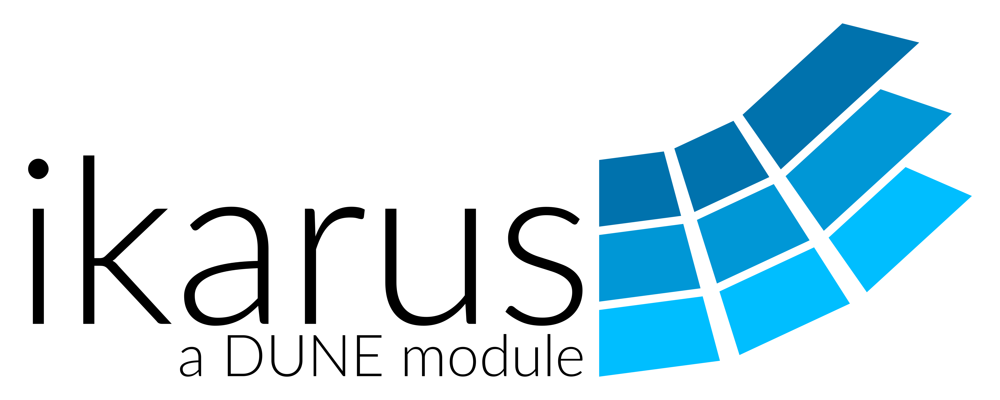

# Ikarus

<!--
SPDX-FileCopyrightText: 2021-2025 The Ikarus Developers ikarus@ibb.uni-stuttgart.de
SPDX-License-Identifier: LGPL-3.0-or-later
-->

  

  

This project tries to provide an easy to read and an easy to use finite element framework.
It is heavily inspired by the finite element software [DUNE](https://dune-project.org/), the book
[DUNE — The Distributed and Unified Numerics Environment](https://www.springer.com/gp/book/9783030597016),
[deal.II](https://www.dealii.org/) and [Kratos](https://github.com/KratosMultiphysics/Kratos).
Furthermore, it directly uses several modules from [DUNE](https://dune-project.org/).

We favor value semantics and readability.

Concerning the design of CI and the documentation we were inspired by [Autodiff](https://autodiff.github.io/)  and [Kratos](https://github.com/KratosMultiphysics/Kratos).

The documentation resides at [https://ikarus-project.github.io/](https://ikarus-project.github.io/).

If you use Ikarus, please cite the dataset by clicking on the doi badge above and then selecting "Cite Dataset," where you will find
several citing options.

## Contributors

  <a href="https://www.ibb.uni-stuttgart.de/">Institute for Structural Mechanics</a> of the
<a href="https://www.uni-stuttgart.de/">University of Stuttgart</a>

