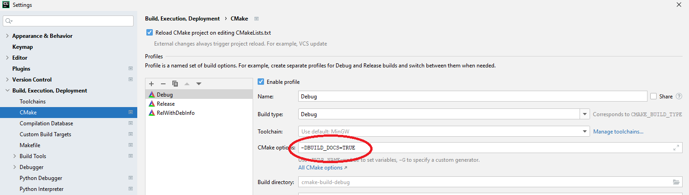
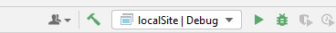
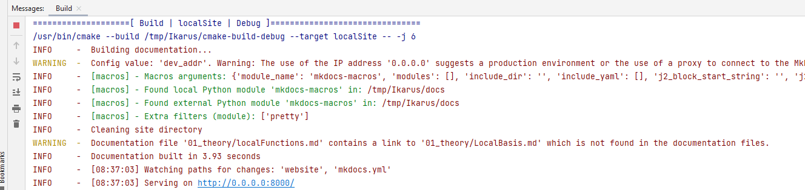
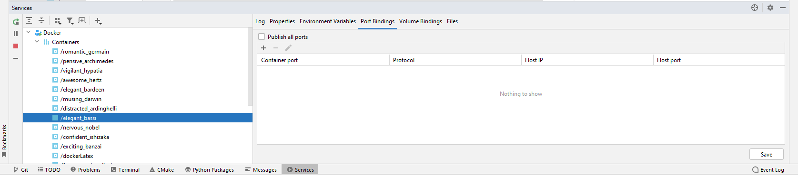
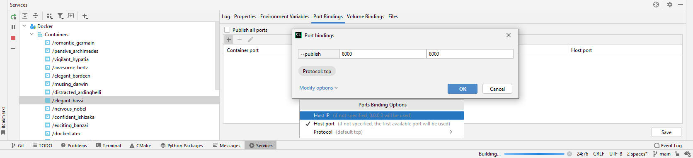

# How to edit this documentation

## Prerequisites

- Ikarus cloned on your computer,
  see [the download page](../download.md).

## Preview the documentation locally

- Change the cmake option, for example, in Clion: Open `File --> Settings --> Build,Execution,Deployment --> Cmake`.
  Add `-DBUILD_DOCS=TRUE` to your cmake options
  
- Choose target `localSite` and build it (for instance, click on the hammer)

  

- After a couple of seconds, build messages should appear that look similar to the picture below.
  
- Click on `Services` in the footer, double-click on `Docker` and unfold `Containers`. There should be
  one container with a blue box, while the other containers have a blue box with a white square inside
  (see figure below). In this example, the container we are looking for is `elegant_bassi`.
  The name will be different on your computer, but the relevant criterion for finding the container
  is the blue box.
  
- Click on the container with the blue box and navigate to `Port Bindings`.
- Add a new port by clicking on `+`, activate `Host port` under `Modify options` and enter
  `8000` in both fields (see image below). Confirm with `OK`.
  
- Click on `Save` in the lower right corner. This will restart the container. Messages will appear
  saying that the build failed. These messages can be ignored. The build process restarts automatically.
- After a few seconds, [Click on this link](http://127.0.0.1:8000/).
- Now you should see a live preview of the documentation in your browser.
- You can edit the documentation in CLion. `Ctrl` + `s` saves the documentation and updates it in
  the browser window.
- Cancel the build process to stop the live preview. To restart the live preview, you will have to
  modify the container settings again. Therefore, it is recommended to stop the live preview
  only after you have finished working on the documentation.
