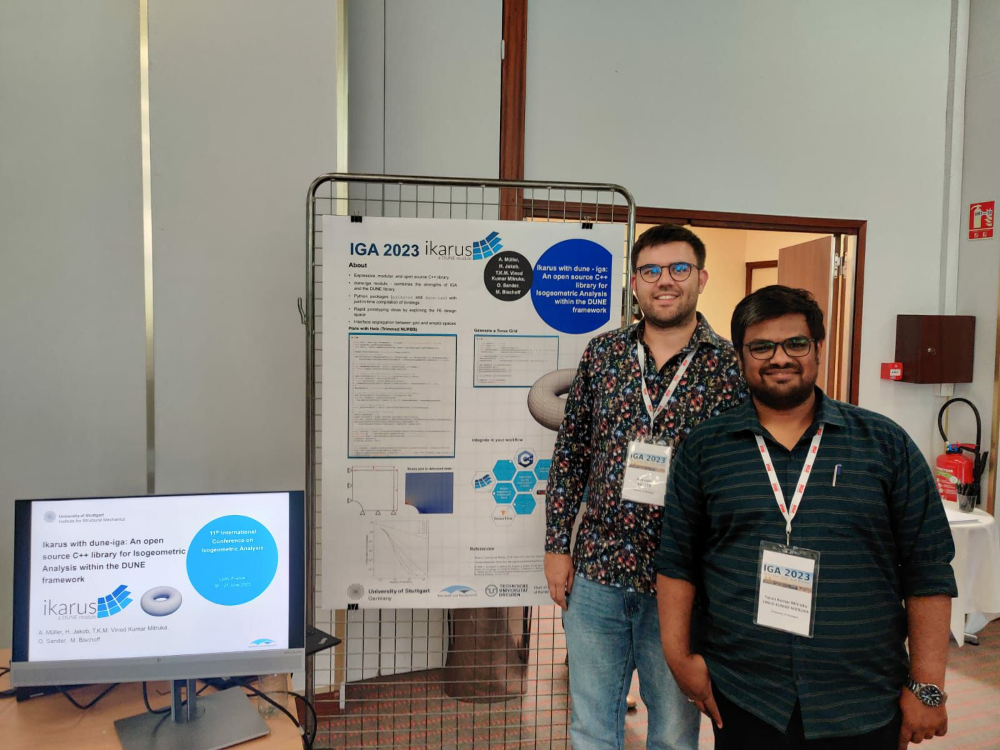

# Release of v0.4 (Ganymede)

**On our journey to Ikarus v1.0, we've taken another significant step forward. Explore the latest release, v0.4 (Ganymede).
This release not only focuses on refactoring various interfaces but also introduces
exciting features such as Python bindings, result evaluators, the Kirchhoff-Love shell element,
added support for Clang 16, and more.**

- :fontawesome-brands-python: **Python** for accessibility, [PyPi](https://pypi.org/project/pyikarus/)
- :fontawesome-brands-docker: **Docker** for reproducibility and ease of use, [DockerHub](https://hub.docker.com/r/ikarusproject/ikarus-dev)
- :fontawesome-solid-book: **Documentation** Doxygen class documentation and examples [Class documentation](../../doxygen/html/index.html)
- :fontawesome-brands-gitter: **Gitter chat** For discussions and support, [Chat](https://gitter.im/ikarus-project/community)
- :fontawesome-solid-terminal: **Clang 16** Clang support for more C++ standard compliant code

<!-- more -->

## Python bindings

As mentioned in the [blog post](v0.3.md) of the v0.3 (Prometheus) release, Ikarus is a C++ library for finite element analysis.
In this version, we've introduced Python bindings, allowing users to work seamlessly within Python while still using Ikarus' powerful C++ backend.
These bindings are now available on [PyPi](https://pypi.org/project/pyikarus/), making it easy to install Ikarus with `pip install pyikarus`.
These Python bindings depend on other DUNE libraries because they are compiled just-in-time (JIT).
The easiest way to use the Python bindings is therefore within the provided Docker images [Docker image](https://hub.docker.com/r/ikarusproject/ikarus-dev)
we provide.
This addition aims to expand Ikarus's usage in academia for teaching purposes, providing a simpler interface for Python users.
Now, Ikarus can thus be integrated with popular libraries like [TensorFlow](https://www.tensorflow.org/) and [SciPy](https://scipy.org/) for data-driven simulations.

<figure class="inline end" markdown>

  <figcaption style="font-size: 12px"><a href="https://commons.wikimedia.org/wiki/File:Ganymede_receives_the_bowl_from_Hebe,_by_Peter_Paul_Rubens.jpg">The Rape of Ganymede
</a> by <a href="https://en.wikipedia.org/wiki/Peter_Paul_Rubens">Peter Paul Rubens</a></figcaption>

  <figcaption style="font-size: 12px"><a href="https://en.wikipedia.org/wiki/Ganymede_(moon)">Ganymede</a> photographed by Juno in 2021. Moon of Jupiter and largest moon in the solar system.</figcaption>
</figure>

## Finite element technology

While linear-elastic finite elements and geometrically non-linear elements based on automatic differentiation were already present in Ikarus,
this release introduces a more explicit implementation of non-linear elements for increased efficiency.
Post-processing capabilities have been enhanced with wrappers for evaluating results like Von-Mises stress, principal stresses, and other
stress measures specific to different finite elements. Assemblers now allow the study of raw matrices and vectors before applying any boundary
conditions.
The release also integrates an interface for a material library, including material models like the St. Venant-Kirchhoff and a Neo-Hookean model.
One can directly use these in the finite element analysis, even for plane stress problems, by utilizing a vanishing stress wrapper ([Doxygen](../../doxygen/html/a01321.html)).
Improved control loggers enable static non-linear analysis, providing relevant information to users.
Additionally, a non-linear Kirchhoff-Love shell element is now available for studying thin-walled structures.

## Documentation

This release includes detailed documentation for all examples in `ikarus-examples` and adds [Doxygen](../../doxygen/html/index.html)
class documentation.
Each class and public function now have Doxygen comment blocks that provide comprehensive descriptions.

## Miscellaneous

In addition to the mentioned features, some miscellaneous additions have been made.
Changes in the directory structure and file naming now follow the convention of using only lowercase letters.

In addition, we've introduced Clang 16 support in this release, giving users the flexibility to choose their preferred compiler.
Ikarus continues to support GCC 12, ensuring compatibility with multiple compilers.

## Conferences

During 2023, Ikarus gained popularity and was presented at two conferences:
the [11th International Conference on Isogeometric Analysis](https://iga2023.sciencesconf.org/) and the [Dune User Meeting 2023](https://dune-project.org/community/meetings/2023-09-usermeeting/).
A snapshot from the IGA conference is shared, where Ikarus was presented alongside the `dune-iga` module.

<figure class="inline end" markdown>
{width = "400"}
<figcaption>Ikarus presented at the <a href="https://iga2023.sciencesconf.org/">11th International Conference on Isogeometric Analysis</a> (Alex (left) and Tarun(right))</figcaption>
</figure>>

## What next?

The following are some key milestones that have been completed or are planned to be released as stepping stones to version 1.0.

- [x] Workflows
    - [x] License and example checks ([#107](https://github.com/ikarus-project/ikarus/pull/107) and [#114](https://github.com/ikarus-project/ikarus/pull/114))
    - [x] Create Docker images
    - [x] Create a workflow to create a "release" and add a version to [DaRUS](https://darus.uni-stuttgart.de/dataset.xhtml?persistentId=doi%3A10.18419%2Fdarus-3303&version=DRAFT)
    - [x] Deploy Python bindings to [PyPi](https://pypi.org/) and create Python bindings
    - [x] Clang 16 support ([#186](https://github.com/ikarus-project/ikarus/pull/176 "To pull request"))

- [ ] Finite element technology
    - [x] Linear elastic finite elements with EAS ([#74](https://github.com/ikarus-project/ikarus/pull/74 "To pull request"))
    - [x] Path-following techniques ([#80](https://github.com/ikarus-project/ikarus/pull/80 "To pull request"))
    - [x] Efficient implementation of non-linear elasticity ([#160](https://github.com/ikarus-project/ikarus/pull/160 "To pull request"))
    - [x] Wrapper to evaluate results ([#165](https://github.com/ikarus-project/ikarus/pull/165 "To pull request"))
    - [x] Interface for a mechanical-material library ([#154](https://github.com/ikarus-project/ikarus/pull/154 "To pull request"))
    - [x] Kirchhoff-Love shell elements ([#177](https://github.com/ikarus-project/ikarus/pull/177 "To pull request")
    and [#225](https://github.com/ikarus-project/ikarus/pull/225 "To pull request"))
    - [x] Default adaptive step sizing and improved control loggers ([#193](https://github.com/ikarus-project/ikarus/pull/193 "To pull request"))
    - [ ] Standard plate and beam elements
    - [ ] Handling inhomogeneous Dirichlet boundary conditions in all existing solving methods
    - [ ] Enhance the mechanical-material library
    - [ ] Linear dynamics
    - [ ] Local Assemblers
    - [ ] Handling of reduced matrices and vectors
    - [ ] Advanced adaptive step sizing features
    - [ ] Push-forward and pull-back operations for stress measures
    - [ ] Advanced locking-free non-linear finite elements

- [ ] Documentation
    - [x] Improving existing documentation and describing examples of Ikarus
    ([#106](https://github.com/ikarus-project/ikarus/pull/106 "To pull request")
    and [#125](https://github.com/ikarus-project/ikarus/pull/125 "To pull request"))
    - [x] Detailed explanations of examples in Ikarus ([#140](https://github.com/ikarus-project/ikarus/pull/140 "To pull request"))
    - [x] Class documentation ([#220](https://github.com/ikarus-project/ikarus/pull/220 "To pull request"))
    - [ ] More Documentation for Python bindings
    - [ ] Document list of dependencies
    - [ ] Gallery
