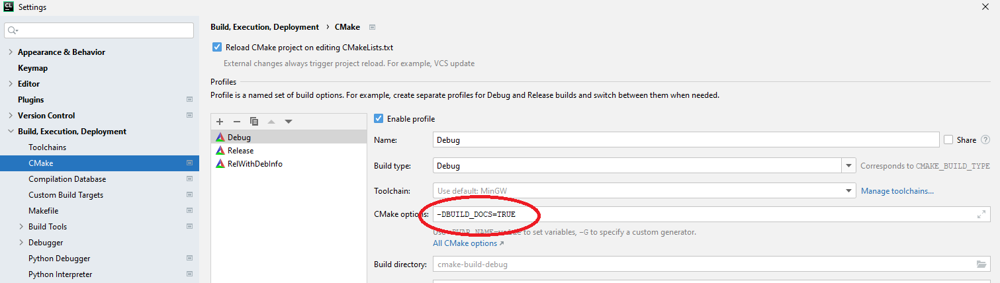

# How to edit this documentation

## Prerequisites

- Ikarus cloned on your computer, 
  see [the installation page](../installation/#clone-ikarus).
- **On Windows:** Make sure [Python](https://www.python.org/downloads/) and 
  [Drawio](https://github.com/jgraph/drawio-desktop/releases) are installed on 
  your computer. Admin rights are required for the installation, contact your
  admin if it's not installed.
- **On Linux:** execute:
```sh 
wget https://github.com/jgraph/drawio-desktop/releases/download/v14.6.13/drawio-amd64-14.6.13.deb
sudo apt-get install libappindicator3-1
sudo dpkg -i drawio-amd64-14.6.13.deb
sudo apt-get -y -f install
sudo apt install libasound2 xvfb
```

## Preview the documentation locally
- Open the Windows PowerShell (click the windows button on your keyboard and type
  `Windows PowerShell`)
- change the directory to:
  `cd C:\MyFolder\AnotherFolder\Ikarus\docs\BuildLocally\`. Replace `MyFolder` etc. with 
  the correct path to your local Ikarus copy
- type `InstalldepsForDocBuild.sh` and press enter
- Another window should open now which installs python packages. Wait until it closes itself.
- Open `File --> Settings --> Build,Execution,Deployment --> Cmake` 
  Add `-DBUILD_DOCS=TRUE` to your cmake options 
  
- Choose target `localSite` and build it (click on the hammer)
  
  
  
- [Click on this link](http://127.0.0.1:8000/)
- Now you should see a live preview of the documentation in your browser
- Cancel the build process to stop the live preview
