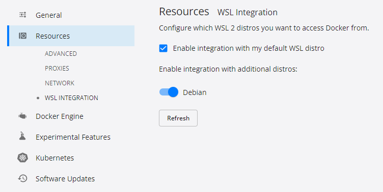
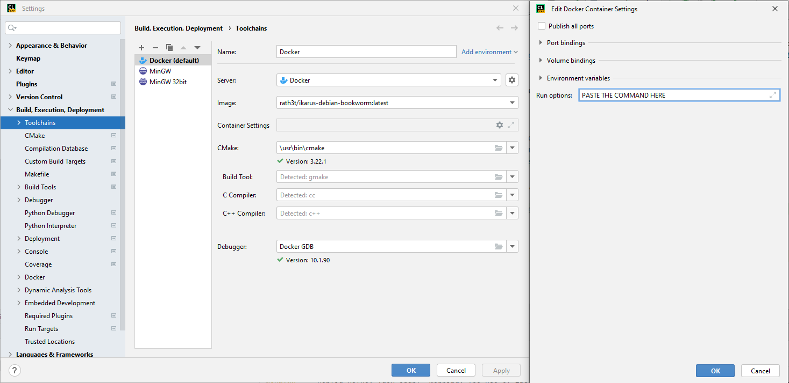
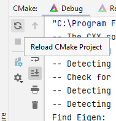
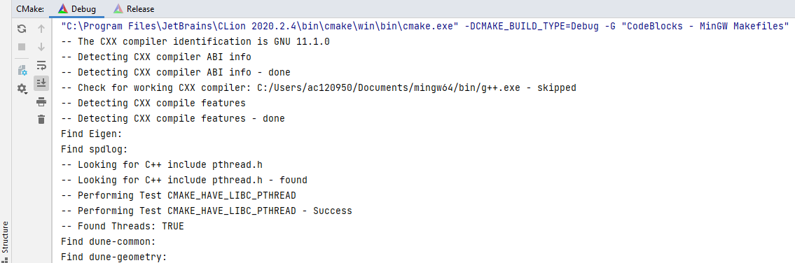

# Installation of Ikarus

!!! warning "Change links on this website when final accounts for repository and docker container are fixed and remove this warning."

Graphical output is currently not supported on Windows 10 (but will probably be available in the future). Therefore,
working on Windows 11 is recommended.

The installations on Windows relies on WSL 2, i.e. although working with Windows, the code is compiled and executed in Linux.

## Installation on Windows using Docker Container and Clion

1. Install WSL: Open the PowerShell as an admin and execute the following commands. Reboot afterwards, if requested.

    ```sh
    wsl --install
    wsl --set-default-version 2 #(Is not needed for Windows 11)
    ```

2. [Download and install Docker for Windows](https://docs.docker.com/desktop/windows/install/).
  During the installation, select the option "Install required Windows components for WSL 2"
3. Install debian from [WindowsAppStore](https://www.microsoft.com/en-us/p/debian/9msvkqc78pk6#activetab=pivot:overviewtab)
    1. Open the debian app
    2. Give yourself a username and password
    3. Close the debian app
4. Open the PowerShell and execute:

    ```sh
    wsl --list --all
    # `Debian` should appear as one of the available Linux distributions.
    ```

5. In the PowerShell execute:

    ```sh
    wsl --setdefault Debian
    ```

6. Try to start Docker. If it works, continue with the next step. If a message occurs that you are not allowed to use docker because
    you are not in the docker user group, follow [these instructions](https://icij.gitbook.io/datashare/faq-errors/you-are-not-allowed-to-use-docker-you-must-be-in-the-docker-users-group-.-what-should-i-do).
    In short:
    1. Open **computer management** as admin
    2. Go to **Local users and groups** and find **docker-users**
    3. Add your Account (or a group of which you are a member) to the group.
    4. Restart your computer
7. In Docker, go to Settings --> General and select autostart for docker
    (otherwise you have to start it manually each time you want to work with Ikarus).
8. In the Docker settings, select that Docker uses your WSL2 distribution Debian as shown in the picture.
    
    In cases docker says that you don't have a WSL 2 distribution, go to the PowerShell and execute

    ```sh
    wsl --set-default-version 2 #(just to be sure that you didn't forgot this at the beginning)
    wsl --set-version Debian 2 #(Converts debian to version 2)
    ```

    You should now be able to change the docker settings according to the picture above.
9. Open the PowerShell and execute:

    ```sh
    docker pull ikarusproject/ikarus-dev:latest #if you want to develop in Ikarus
    docker pull ikarusproject/ikarus:latest #if you want to use Ikarus to run your own main file as in https://github.com/ikarus-project/ikarus-examples
    ```

10. Download and install [CLion](https://www.jetbrains.com/clion). You need a version >=2022.1.
11. In CLion, go to **File** and **Settings** and apply the following settings for the toolchain:
    
    Edit the Container settings and paste the following command into `Run options`:

    ```sh
    -e DISPLAY=:0 -v \\wsl$\debian\mnt\wslg\.X11-unix:/tmp/.X11-unix -v \\wsl$\debian\mnt\wslg:/mnt/wslg --cap-add=SYS_PTRACE
    ```

## Clone Ikarus

- Clone the Ikarus repository.
- Open the `CMake` tab in the CLion footer:
  
- Click on `Reload CMake project` (refresh symbol):
  
- CMake now detects all required sources automatically. The output should look similar to
  the screenshot below:
  

## Installation on Linux

1. If you have docker available, simply pull the container with Ikarus installed to start developing.

    ```sh
    docker pull ikarusproject/ikarus:latest
    ```

2. Log in to the container via

    ```sh
    docker container run -it --entrypoint /bin/bash  ikarusproject/ikarus:latest
    ```

3. Instead of point 2, one can now also follow the documentation above if Clion on Linux is preferred.
