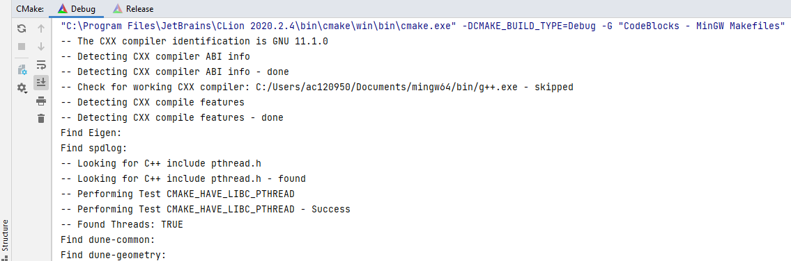

# Installation of Ikarus

# Install in WSL on Windows
- In the windows powershell as admin
  ```sh 
  wsl --install
  wsl --set-default-version 2 #(Is not needed for Windows 11)
  ```
- Reboot
### Install debian
- Install from [WindowsAppStore](https://www.microsoft.com/en-us/p/debian/9msvkqc78pk6#activetab=pivot:overviewtab)
- Execute the debian app
- Give yourself a username and password
- Execute `sed -i 's/bullseye/bookworm/g' /etc/apt/sources.lists`
- Execute 
  ```sh 
  sudo apt update && \
  sudo apt full-upgrade -y && \
  sudo apt -y install lsb-release && \
  sudo apt -y install build-essential \
  libssl-dev \
  git \
  wget \
  apt-utils \
  software-properties-common \
  gfortran \
  gcc-11 \
  g++-11 \
  gcovr \
  clang \
  libmetis-dev \
  clang-tidy \
  libclang-13-dev \
  clang-format-13 \
  libc++-13-dev \
  libc++abi-13-dev \
  llvm-13-dev \
  liblapack-dev \
  libopenblas-dev \
  libsuitesparse-dev \
  libdune-common-dev \
  libdune-geometry-dev \
  libdune-grid-dev \
  libdune-functions-dev \
  libdune-typetree-dev \
  libdune-localfunctions-dev \
  libdune-uggrid-dev \
  libdune-grid-glue-dev \
  libdune-istl-dev \
  libspdlog-dev \
  libbenchmark-dev \
  libgtest-dev \
  gnuplot \
  python3 \
  pip \
  clang-format-12 \
  gnuplot-x11 \
  curl \
  cppcheck && \
  wget https://github.com/jgraph/drawio-desktop/releases/download/v16.5.1/drawio-amd64-16.5.1.deb && \
  sudo apt-get install libayatana-appindicator3-1 && \
  sudo dpkg -i drawio-amd64-16.5.1.deb && \
  sudo apt-get -y -f install && \
  sudo apt install libasound2 xvfb -y && \
  pip install cmakelang==0.6.13 pyyaml && \
  pip install mkdocs && \
  pip install mkdocs-material && \
  pip install mkdocs-macros-plugin && \
  pip install mkdocs-drawio-exporter && \ && \
  sudo cp /usr/bin/clang-format-12 /usr/bin/clang-format && \
  cd /usr/local/bin && \
  sudo ln -s $HOME/.local/bin/cmake-format cmake-format && \
  sudo ln -s $HOME/.local/bin/mkdocs mkdocs && \
  cd ~ && \
  mkdir -p iwyu && \
  cd iwyu && \
  git clone https://github.com/include-what-you-use/include-what-you-use.git && \
  cd include-what-you-use && \
  git checkout clang_13 && \
  cd .. && \
  mkdir -p build && cd build && \
  cmake -G "Unix Makefiles" -DIWYU_LLVM_ROOT_PATH=/usr/lib/llvm-13 ../include-what-you-use && \
  make && \
  sudo make install && \
  cd /usr/src/googletest && \
  cmake . && \
  sudo cmake --build . --target install && \
  cd ~/ && \
  git clone https://gitlab.com/libeigen/eigen.git && \
  cd eigen && \
  git checkout 3.4 && \
  mkdir build && \
  cd build && \
  cmake ../ && \
  sudo make install && \
  cd .. && \
  cd .. && \
  rm -r eigen && \
  git clone https://github.com/alandefreitas/matplotplusplus.git && \
  cd matplotplusplus && \
  mkdir -p build && \
  cd build && \
  cmake .. -DCMAKE_BUILD_TYPE=Release -DBUILD_EXAMPLES=OFF -DBUILD_TESTS=OFF && \
  cmake --build . --parallel 4 --config Release && \
  sudo cmake --install . && \
  cd ../.. && \
  rm -r matplotplusplus && \
  git clone https://github.com/autodiff/autodiff && \
  cd autodiff/ && \
  mkdir .build && \
  cd .build/ && \
  cmake .. -DAUTODIFF_BUILD_PYTHON=0 -DAUTODIFF_BUILD_EXAMPLES=0 -DAUTODIFF_BUILD_DOCS=0 -DAUTODIFF_BUILD_TESTS=0 && \
  sudo cmake --build . --target install && \
  cd ../.. && \
  mkdir -p dune && \
  cd dune && \
  git clone https://gitlab.dune-project.org/extensions/dune-alugrid.git && \
  git clone https://gitlab.dune-project.org/extensions/dune-foamgrid.git && \
  dunecontrol git checkout releases/2.8 && \
  git clone https://github.com/rath3t/dune-iga.git && \
  dunecontrol cmake "-DCMAKE_BUILD_TYPE=Release" && \
  dunecontrol make && \
  sudo dunecontrol make install && \
  cd .. && \
  rm -rf dune && \
  sudo apt-get auto-remove -y && \
  sudo apt-get clean
  ```

- In Clion setting:
  - Build, Execution, Deployment --> Toolchains
  - Add with the `+`-sign a WSL configuration
  - Make sure it is used as default (Move it up with the arrow buttons otherwise)
  - 
  
## Clone Ikarus

- Clone the Ikarus repository as you do it with any other repository (e.g. using GitKraken)
- ToDo: Describe here how to access it from Github.com
- Open the CMake tab `CMake` in the CLion footer: 
  
- Click on `Reload CMake project` (refresh symbol)  

- CMake now detects all required sources automatically. The output should look similar to
the screenshot below

  

## Further reading:
As the next step: We recommend to read the following pages:
- ToDo
- ToDo
- ...
