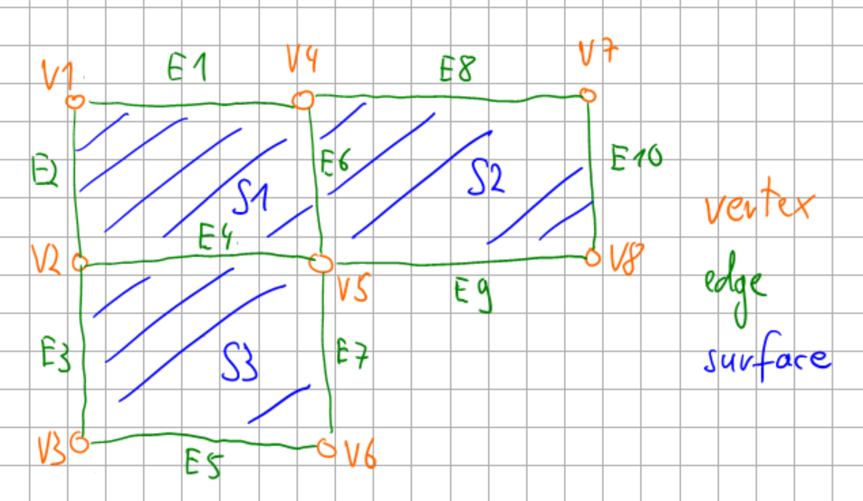

# Description of the grid

In finite element simulations, we often talk about elements and meshes. What we commonly refer to as "element"
consists of various aspects with different tasks, e.g.  

- provide a unique identifier (element number)
- provide a description of the reference geometry (element shape in physical space, shape functions, etc.)
- provide quantities with physical meaning (mass matrix, stiffness matrix, internal force vector, etc.)
- ...

In the code, there is not one single class which performs all these tasks. Different tasks are performed by 
different classes, which are described in the following. Especially, the description of the geometry is
decoupled from the task to provide physical meaning. The following content is only about the 
**description of the element geometry**. Details on 
[the implementation of physical quantities can be found here](theoryFiniteElement.md).

The grid description will be explained using the following example


## Grid
The grid is a collection of grid entities. In the example above, the grid consists of three surfaces, 
ten edges and eight vertices, i.e. it consists of 21 grid entities. Since it is some work to construct all
these quantities and their relations, there is the [grid factory](theoryGrid.md#grid-factory) 
which does this job.

### Interface of the grid
- `leafGridView()`: returns a [grid view](theoryGrid.md#grid-view), 
i.e. an object which can iterate over the grid. 

### Available grid implementations
`SimpleGrid`: Currently the only available grid implementation. To construct it, use `SimpleGridFactory`,
 as a grid view use `SimpleGridView`.
It has the following **capabilities**:

- It is a template: `SimpleGrid<dim,wdim>` where `dim` is the dimension of the grid entities and 
   `wdim` is the dimension of the world. Dimension of grid entity in this case means:
    - dim=1: e.g. truss elements, beams (one element-internal coordinate xi exists)
    - dim=2: e.g. plate elements (two element-internal coordinates xi and eta exist)
    - dim=3: 3d elements
- All meaningful combinations up to three dimensions can be instantiated, e.g. 
  truss elements (dim=1) in 2d (wdim=2)
- Different types of grid entities are supported in the same grid as long as they have the 
  dimension specified by `dim` (for details on these types see TODO):
    - dim=1: linearLine
    - dim=2: linearTriangle, linearQuadrilateral
    - dim=3: linearTetrahedron, pyramid, prism, linearHexahedron

Some **restrictions** apply:

- You can't insert grid entities of different dimensions into the same `SimpleGrid`
- Other types than the ones mentioned above are not supported

## Grid entity
A grid entity provides all information related to the element geometry. 

### Interface of grid entity

A grid entity has the following properties: 

- `geometry()`: returns the geometrical realization, i.e. an object that satisfies the
   geometry interface. Further details about this interface and what the returned object is able to do
  can be found on the [geometry theory page](theoryGeometry.md).
- `type()`: returns the geometrical type, e.g. it can be a vertex, a linear line 
   defined by two point or a quadrilateral with linear edges. 
   The difference between `type()` and `geometry()` is that `type()` only returns a name whereas
   `geometry()` returns an object with functionality.
- `vertices(gridEntity)`, `edges(gridEntity)`, `surfaces(gridEntity)` and `volumes(gridEntity)`:
   Each entity has sub-entities of lower dimension. In the example above, surface S1 has the following
   sub-entities: four edges (number 1,2,4,6) and four vertices (number 1,2,4,5). `vertices(S1)`
   returns a span of vertices. The other functions work similarly.
- `entities(gridEntity, dimension)` does the same as the functions above, i.e.
    - `entities(gridEntity, 0)` does the same as `vertices(gridEntity)`.
    - `entities(gridEntity, 1)` does the same as `edges(gridEntity)`.
    - ...
- `subEntities(codimension)` returns the number of subentities. Codimension in this case is the dimension
   of the grid entity minus the dimension of the requested subentity. Example: The grid entity 
   is a 3d volume. subEntities(1) returns the number of surfaces of this volume because codimension=1
   means your query is about the subentities one dimension lower than the object itself.
- `getID()`: returns a unique identifier


### Implementation of grid entity
There is currently one implementation of the GridEntity interface available, which is `DefaultGridEntity`. It is
supposed to be used together with the grid implementation `SimpleGrid`.
```cpp
  template <int griddim, int cogriddim, int wdim>
  class DefaultGridEntity {
    // ...
  };
```
It is based on three template parameters `griddim`(dimension of the grid), `cogriddim`(???) and 
`wdim`(dimension of the world).

@ Alex: Could you explain the implementation details here? 
How are the private quantities (e.g. entitiesFathers) constructed?

## Grid factory
To construct a grid, a grid factory can be used. To construct a grid, vertices and element
definitions are inserted into the factory. The grid is then constructed by the `createGrid()` function.

### Interface of the grid factory

- `insertVertex(Eigen::Vector<double, dimensionworld>)`: Vertices are inserted as a Eigen::Vector
  of double. Its size is equal to the dimensions of the world (e.g. 2 if it is a 2d simulation etc.)
- `insertElement(Ikarus::GeometryType type, std::span<size_t> vertices)`: An element is defined
 by its geometrical type and the vertex numbers. For the ordering of the node numbers, see ToDo

### Implementation of grid factory
`SimpleGridFactory`: Constructs a `SimpleGrid`. The same restrictions apply as stated above for `SimpleGrid`. 

@ Alex: Could you explain some details about the implementation here?

## Grid view


### Interface of grid view

The interface of a grid view consists of four free functions. Each of them provides a span of
certain grid objects:

- `vertices(GridView)`: returns a span of all vertices in this grid
- `edges(GridView)`: returns a span of all edges in this grid
- `surfaces(GridView)`: returns a span of all surfaces in this grid
- `volumes(GridView)`: returns a span of all volumes in this grid

### Implementation of grid view

`SimpleGridView`: Provides iterators for `SimpleGrid`. 

@ Alex: Ideas behind the implementation?
